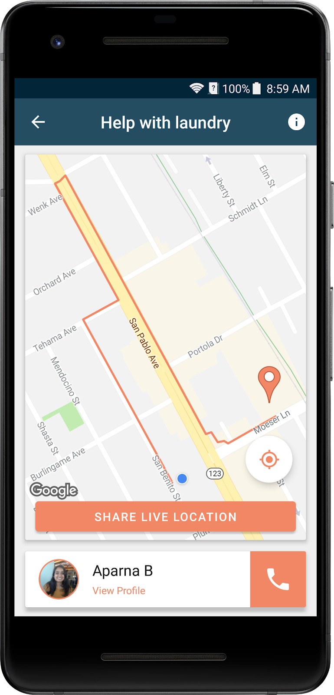
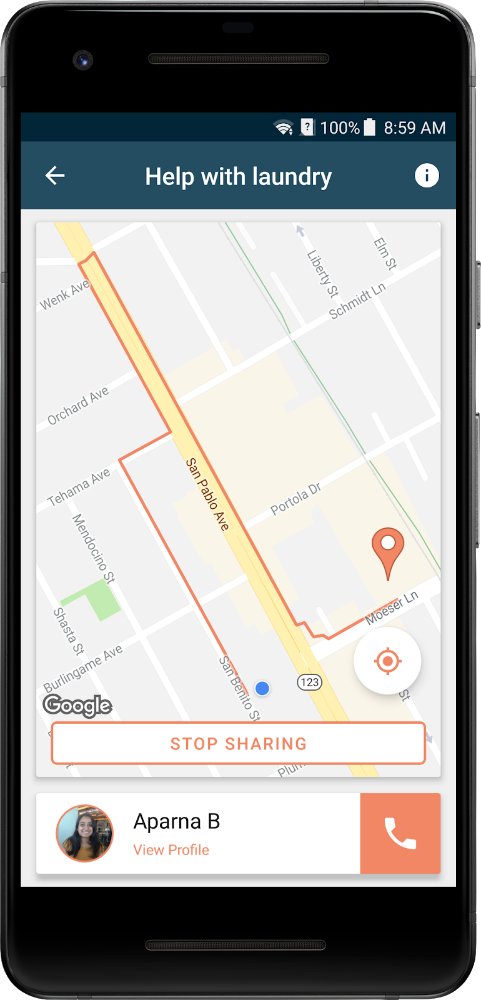

# Assist
Oftentimes, disabled/elderly citizens need assistance with daily activities such as grocery shopping or crossing the street. Assist connects those in need with altruistic volunteers, who can offer them assistance with such activities. Activities are designed to be carried out on-the-go, for someone with a few minutes to spare. 
In the app, disabled/elderly citizens put in requests specifying the task type, a description, and location. Volunteers view these tasks and accept tasks that are convenient for them, which notifies the disabled/elderly user. When a volunteer shares their location, the disabled user sees a map of the volunteer’s location.

## Libraries Used
* [GeoFirestore-Android](https://github.com/imperiumlabs/GeoFirestore-Android) for geographic location based query in Firestore (extended to include extra constraints on query)
* [Floating Search View](https://github.com/arimorty/floatingsearchview) for persistent search bar (extended for extra functionality)
* [CircleImageView](https://github.com/hdodenhof/CircleImageView) for circular images
* [StepView](https://github.com/shuhart/StepView) for step view in in add request screen
* [Glide](https://github.com/bumptech/glide) for loading images from the web

## API Used
* Facebook: Login
* Google Cloud Platform: App Engine Cron Service (for scheduling a database cleanup every minute, as well as notifying the disabled/elderly user when a volunteer has accepted one of their tasks, alongside with Google Firebase Functions)
* Google Firebase: Firestore Database, Authentication, Functions, Storage
* Google Play Services: Auth, Location, Maps, Places, Routes

## Screenshots

    

